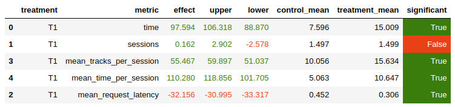

# Homework
TLDR:
Дообучил эмбединги дополнительно используя информацию об артистах + скорректировал логику самого рекомендера

## Воспроизводимость
Обучение модели для нахождения похожих треков
1. `create_extended_dataset.ipynb` - подготовили данные (добавление artist_id) 
2. `main.py` - обучили эмбединги 
3. `predict_recommendations.ipynb` - получение json-файла ([tracks_my_nn_recs.json](tracks_my_nn_recs.json)) с рекомендациями (не забудьте поменять путь до чекпоинта, если производили самостоятельное обучение. Свой чекпоинт я не выкладывал, если будет необходимость - пишите)
4. Скопируйте [tracks_my_nn_recs.json](tracks_my_nn_recs.json) в папку с данными для botify (`botify/data/tracks_my_nn.recs_json`)
5. Поднимите botify (через docker-compose)
6. Запустите прогон рекомендаций на 4000 эпизодов (`--episodes 4000 --config config/env.yml single --recommender remote --seed 31337`)
7. В ноутбуке с первого семинара можно убедиться в работоспособности нового рекоммендера

## Рекомендер
Рекомендер:
Нейросеть для эмбедингов (`model.py`):
Пробовал разные подходы, но усложнение сети не давало результатов
- добавлял линейные слои
- добавлял нелинейность

Лучше всего сработало дополнительное обучение эмбедингов не только треков, но и артистов
(учим два набора ембедингов `artist_context/artist_track`, аналогия как с эмбедингами треков)

Алгоритм рекомендера(`../botify/botify/recommenders/best.py`):
1. пользователь выбирает первый трек, который ему нравится сам, поэтому и дослушивает его до конца.
Мы формируем список похожих песен (далее СПИСОК), и для пользователя он остается неизменным.
2. Все последующие треки будут основываться не на предыдущем треке, а на самом первом.
Если из СПИСКА уже все прослушали, рекомендуем самые популярные треки (TopPop рекомендер).
3. Дополнительно хранится список прослушанных пользователем песен, для того, чтобы не повторялись рекомендации (чтобы не получать 0)

